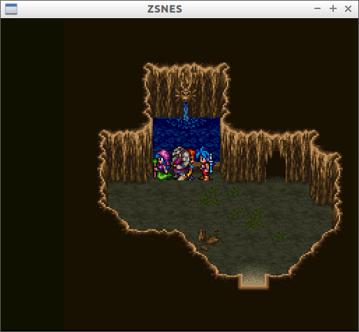
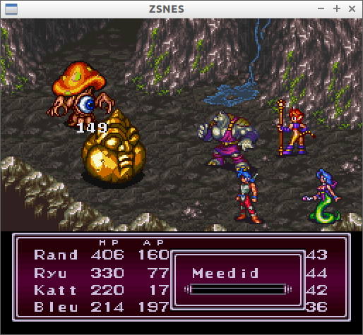
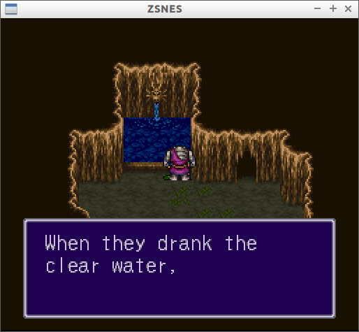

# BreathOfFire2Trainer

Breath Of Fire 2 Trainer using libcvautomation.

In this place, the characters will automatically move left and right ...

fight the monsters by attacking and ...

drink from the fountain.

The AI of the trainer is not very smart. But the number of fights is about 6.5 per minutes.